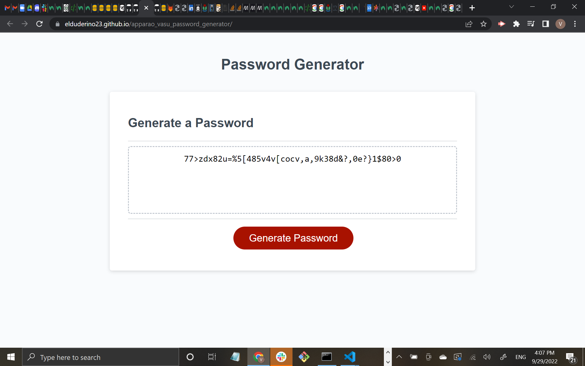

# Password Generator

## Deployable Link
https://elduderino23.github.io/apparao_vasu_password_generator/

## Goal
The task was to make password generator with some starter code and a bare bones script.js file without touching the style.css and or the index.html.
It also needed to to be able show prompts that determined which of the 4 class of characters,(numerical, lowercase, uppercase, ands symbols) would generate a random password with a character length more than 8 but less that 128 character.

## Technology Use
  - Javascript
  - VS Code
  - Git Bash 
  - GitHub

## Execution

The plan of attack started with simply creating an array. The reason behind making the array first before creating any functions or alerts is because a password generator needs characters in order to generate a password. It was also the easiest to conceptualize. 

An example of all the array is shown below:

```Javascript
var lowerCase = ["a", "b", "c", "d", "e", "f", "g", "h", "i", "j", "k", "l", "m", "n", "o", "p", "q", "r", "s", "t", "u", "v", "w", "x", "y", "z"]
var upperCase = ["A", "B", "C", "D", "E", "F", "G", "H", "I", "J", "K", "L", "M", "N", "O", "P", "Q", "R", "S", "T", "U", "V", "W", "X", "Y", "Z"]
var symbols = [" ", "!", "”", "#", "$", "%", "&", "’", "(", ")", "*", "+", ",", "-", ".", "/", ":", ";", "<", "=", ">", "?", "@", "[", ",", ".", "/", ":", ";", "<", "=", ">", "?", "@", "[", "\ ", "]", "^", "_", "`", "{", "|", "}", "~",]
var numbers = ["0", "1", "2", "3", "4", "5", "6", "7", "8", "9",]
```
After the array was written down, the plan started with the functions for each array. For example, a simple boolean with an if statement like the example below:

```Javascript
var askSpecial = false;
  if (confirm("Do You Want Special Characters!")) {
    askSpecial = true;

    general.push(symbols);

  }
  ```
  the genera(dot)(symbols) adds symbols the general array pool which includes uppercase, lower case, and numbers. 
  parameter had to be added to the array, which required creating an another if statement in order to limit the character count into a 8-128 character range like the example below:
  
```Javascript
var general = [];
  let passwordLength = prompt("How many character do you want? More than 8 but less than 128.");
  if (passwordLength == null || passwordLength == "") {
    alert("Error, follow the instruction");
    passwordLength = "Denied"
    return passwordLength;
  ```
Failure to follow the instruction would result in an error alert box. Included with the error message were the words "too big" and "too small".
These else if messages looked like the the following:

```Javascript
  } else if (parseInt(passwordLength) < 8) {
    return passwordLength = "Too small"

  } else if (parseInt(passwordLength) > 128) {
    return passwordLength = "Too big"

  }
  ```
  The function ended on two math.floor(math.random()) to generate the random characters from all the arrays that general pulled. The return pw to end the entire function as seen here:

  ```Javascript
  console.log(general)
  let pw = "";
  console.log(pw);
  for (let i = 0; i < passwordLength; i++) {
    var index = Math.floor(Math.random() * general.length);
    var index2 = Math.floor(Math.random() * general[index].length);
    pw = pw + general[index][index2];
    console.log("this is pw: " + pw);
  }

  return pw;
}
  ```
Overall the first part of the code looked like this:

 ```Javascript
 var generateBtn = document.querySelector("#generate");

function generatePassword() {
  var general = [];
  let passwordLength = prompt("How many character do you want? More than 8 but less than 128.");
  if (passwordLength == null || passwordLength == "") {
    alert("Error, follow the instruction");
    passwordLength = "Denied"
    return passwordLength;

  } else if (parseInt(passwordLength) < 8) {
    return passwordLength = "Too small"

  } else if (parseInt(passwordLength) > 128) {
    return passwordLength = "Too big"

  }
  var askSpecial = false;
  if (confirm("Do You Want Special Characters!")) {
    askSpecial = true;

    general.push(symbols);

  }
  var askUppercase = false;
  if (confirm("Do You Want Uppercase Characters")) {
    askUppercase = true;
    general.push(upperCase);
  }
  var askLowercase = false;
  if (confirm("Do You Want Lower Characters")) {
    general.push(lowerCase);
    askLowercase = true;

  }
  var askNumerical = false
  if (confirm("Do You Want Numerical Characters")) {
    general.push(numbers);
    askNumerical = true;


  }
  console.log(general)
  let pw = "";
  console.log(pw);
  for (let i = 0; i < passwordLength; i++) {
    var index = Math.floor(Math.random() * general.length);
    var index2 = Math.floor(Math.random() * general[index].length);
    pw = pw + general[index][index2];
    console.log("this is pw: " + pw);
  }

  return pw;
}
  ```
The function derived from generatePassword because most of the operation came from that variable.

The last part was surprisingly easy. A let statement within the writePassword suffice.
An example of the example is shown below:

  
```Javascript
function writePassword() {
  var password = generatePassword();
  var passwordText = document.querySelector("#password");
  passwordText.value = password;

  let writtenPassword = alert("Here is your password")
  if (writtenPassword = password) {
    return alert(password);

  }

}
  ```
  Everything shown above and an event listener makes the whole password generator work.

## Result
The end product is a functioning website that can generate passwords as well as show prompts in that determine choice of characters and a character length the user wants.
